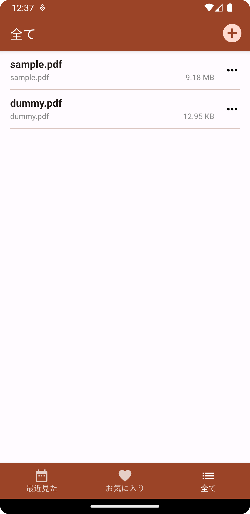
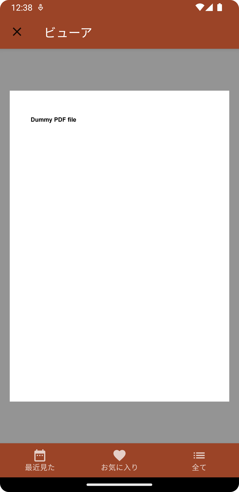
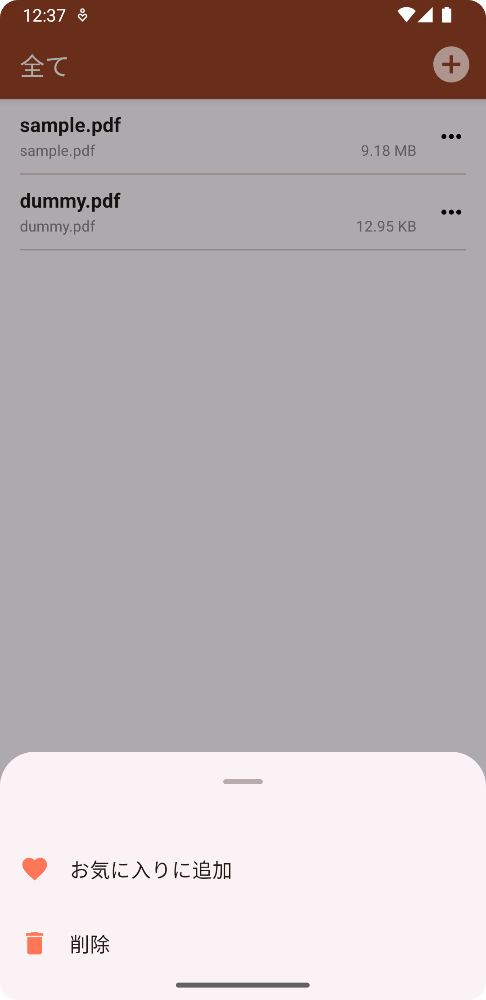
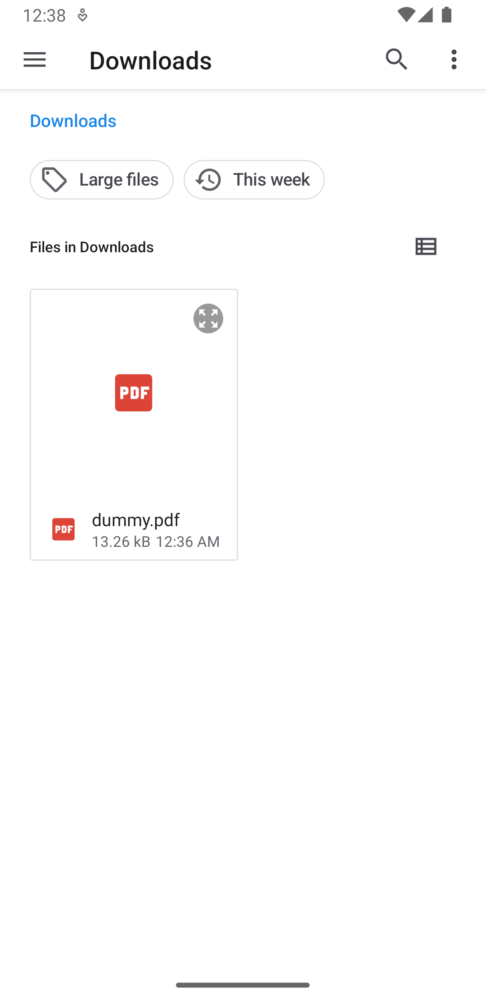

# compose-pdf-viewer

Jetpack Compose で作成した PDF ビューアアプリ

## Technology stack

### Architecture

* MVVM アーキテクチャパターン  
  * View Model: ui/
  * Model: domain/, data/
  * View: ui/

* [Android 推奨のアーキテクチャ](https://developer.android.com/jetpack/guide?hl=ja) に準拠
  * app モジュールの ui/: UI Layer
  * app モジュールの domain/: Domain Layer
  * app モジュールの data/: Data Layer

* [クリーンアーキテクチャ](https://www.amazon.co.jp/exec/obidos/ASIN/4048930656/maple036-22/) に準拠
  * app モジュールの ui/: Presenters
  * app モジュールの domain/: Use Case 、 Entity
  * app モジュールの data/: Controllers 、 Gateways

### Android teck stack

* Jetpack Compose
* フッターメニュー
  androidx.compose.material.BottomNavigation
* ルーティング  
  androidx.navigation:navigation-compose

### Dependencies

* DI(依存性の注入)ライブラリ  
  [Hilt](https://dagger.dev/hilt/)

### その他 teck stack

* [Kotlin DSL](https://docs.gradle.org/current/userguide/kotlin_dsl.html)

## スクリーンショット  

　　  
　　

## 設計

TBD

## 使い方

1. git clone で本プロジェクトをダウンロード
2. Android Studio で本プロジェクトを開く  
   `Android Studio Giraffe | 2022.3.1 Patch 2` を推奨
3. ビルド
